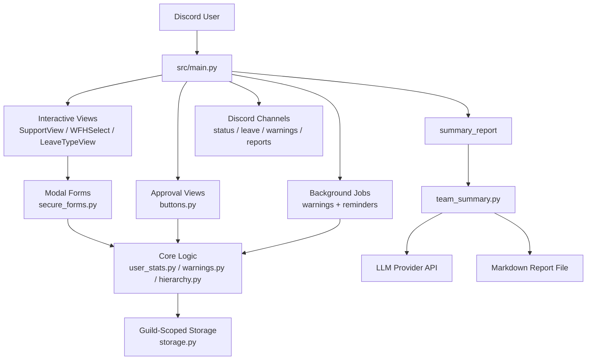
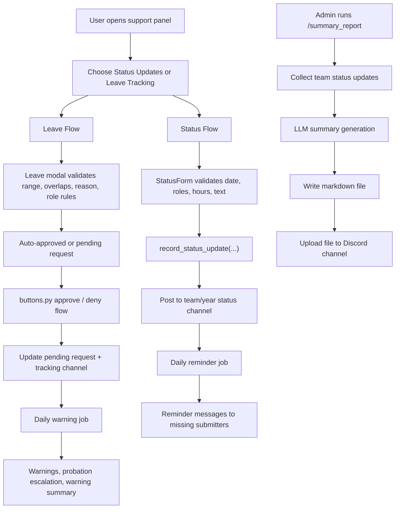

# Discord Work & Leave Tracker Bot

A production-oriented Discord bot for tracking daily status updates, managing leave workflows, enforcing warning rules, and generating operational reports for role-based teams.

This README is a technical reference for the current codebase. It documents the runtime architecture, module-by-module responsibilities, data flow, and operational workflows that exist in the project today.

## Overview

The bot is built around four core responsibilities:

1. Collect daily status updates from current team members.
2. Manage leave requests with validation, auto-approval, and role-based manual approval.
3. Enforce compliance through reminders, warnings, and probation escalation.
4. Provide reporting for activity, warnings, and LLM-generated team summaries.

The bot only manages members with the configured `current-team` role.

## Current Command Surface

| Command | Purpose | Access |
| --- | --- | --- |
| `/setup_support_channel` | Post the main support panel with interactive buttons | Owner only |
| `/export_full_report` | Export CSV activity report for a date range | Administrator |
| `/weekly_report` | Show weekly productivity report for one member or the current team | Administrator |
| `/summary_report` | Generate and upload a team summary report file using the LLM integration | Administrator |
| `/refresh_current_team` | Rebuild the cached `current-team` membership list | Administrator |
| `/my_stats` | Show personal weekly, monthly, warning, and leave metrics | Current-team member |
| `/warning` | View warning report or issue manual warnings | Administrator |

## UI Surface

The support channel message exposes two primary buttons:

- `Status Updates`
- `Leave Tracking`

From there the bot uses Discord native UI components:

- `WFHSelect` for the work-from-hostel choice during status submission
- `LeaveTypeView` for leave-type selection
- Modal forms for status and leave submission
- Persistent approval buttons for leave request review

## Architecture

### High-Level Runtime Flow



### Operational Workflow



## Project Structure

```text
Discord-Bot/
├── src/
│   ├── config.py
│   ├── main.py
│   ├── core/
│   │   ├── channel_lookup.py
│   │   ├── current_team_manager.py
│   │   ├── hierarchy.py
│   │   ├── storage.py
│   │   ├── team_summary.py
│   │   ├── user_stats.py
│   │   ├── utils.py
│   │   └── warnings.py
│   └── ui/
│       ├── buttons.py
│       ├── forms.py
│       └── secure_forms.py
├── data/
├── .env
└── README.md
```

## Module-by-Module Responsibilities

### Entry and Configuration

| Module | Responsibility |
| --- | --- |
| `src/main.py` | Application entry point. Registers slash commands, support views, background tasks, and top-level orchestration. |
| `src/config.py` | Loads environment variables and central runtime settings such as channel IDs, role names, report settings, and LLM settings. |

### Core Modules

| Module | Responsibility |
| --- | --- |
| `src/core/storage.py` | Provides guild-scoped file paths, atomic JSON writes, and per-path locking for safe local persistence. |
| `src/core/user_stats.py` | Stores and queries status updates, weekly/monthly statistics, pending leave requests, and per-date submission lookups. |
| `src/core/warnings.py` | Implements warning rules, leave exemption checks, manual warning validation, warning history, and probation escalation. |
| `src/core/hierarchy.py` | Defines the role hierarchy and authorization rules used by warnings and leave approvals. |
| `src/core/current_team_manager.py` | Maintains a cached view of current-team members per guild and refreshes it on role changes. |
| `src/core/channel_lookup.py` | Resolves or creates the correct team/year status update channel for a member. |
| `src/core/team_summary.py` | Aggregates team updates, builds LLM prompts, handles provider errors, writes markdown summary files, and powers `/summary_report`. |
| `src/core/utils.py` | Shared role validation helpers, especially current-team validation. |

### UI Modules

| Module | Responsibility |
| --- | --- |
| `src/ui/secure_forms.py` | Primary implementation for all status and leave modals. Contains validation, overlap checks, leave rules, CSV export, and submission handling. |
| `src/ui/forms.py` | Compatibility shim that re-exports from `secure_forms.py` so older imports continue to work. |
| `src/ui/buttons.py` | Handles persistent leave approval buttons, thread creation, message updates, and tracking channel messages. |

## Key Workflows

### 1. Daily Status Update Workflow

1. User clicks `Status Updates` in the support panel.
2. Bot shows the `WFHSelect` choice.
3. Bot opens `StatusForm`.
4. `StatusForm` validates:
   - current-team membership
   - team and year roles
   - date format and late-submission window
   - hours worked
   - work description and blockers
5. `record_status_update(...)` writes the submission to guild-scoped storage.
6. The bot posts the formatted update into the correct team/year status channel.

### 2. Leave Request Workflow

1. User clicks `Leave Tracking`.
2. Bot shows leave-type selection.
3. One of these modals opens:
   - `CasualLeaveModal`
   - `MedicalLeaveModal`
   - `SpecialLeaveModal`
   - `WorkFromHostelModal`
4. The form validates:
   - current-team membership
   - role prerequisites
   - date range
   - overlap with existing requests
   - reason length
   - leave-specific business rules
5. Request is either:
   - auto-approved immediately, or
   - stored as pending and sent to the leave request channel
6. Admin reviews and uses approval buttons in `buttons.py`.
7. Request status is updated atomically and logged to the leave tracking channel.

### 3. Warning Workflow

1. Background task runs once per configured day.
2. The bot preloads:
   - users who submitted status for the target date
   - users who are on approved leave for the target date
3. For each current-team member, `should_give_warning(...)` checks:
   - bot status
   - exemption roles
   - required team/year roles
   - approved leave
   - submitted status
4. If needed, `give_warning(...)`:
   - writes warning history
   - updates monthly warning count
   - posts to warning channel
   - escalates probation roles when thresholds are crossed
5. Admins can also issue manual warnings through `/warning`.

### 4. Reminder Workflow

1. Background reminder task runs once per configured day.
2. It preloads submitted-user and leave-user sets once for the guild/date.
3. It filters current-team members who:
   - have not submitted
   - are not on approved leave
   - still match required team/year rules
4. It groups those users by their status-update channel.
5. It posts batched reminder mentions into the relevant channels.

### 5. Team Summary Report Workflow

1. Admin runs `/summary_report`.
2. Bot resolves the selected team and date range.
3. `team_summary.py` collects all relevant status updates for that team.
4. Bot builds a structured LLM prompt with:
   - per-member updates
   - date range
   - formatting rules
5. LLM returns markdown summary.
6. Bot writes a report file under the guild reports directory.
7. Bot uploads the file back to Discord.

## Data Storage Model

The bot stores data locally in guild-scoped folders:

```text
data/
└── <guild_id>/
    ├── users.json
    ├── pending.json
    ├── warnings.json
    ├── casual_leave.json
    └── reports/
```

### File Responsibilities

| File | Purpose |
| --- | --- |
| `users.json` | Status submissions, totals, late-submission counters |
| `pending.json` | Pending and approved leave requests |
| `warnings.json` | Monthly warning counts plus warning history |
| `casual_leave.json` | Casual leave history |
| `reports/` | Exported CSV reports and markdown summary reports |

### Persistence Design

- Storage is guild-scoped to avoid cross-server data mixing.
- Writes are atomic to reduce corruption risk.
- File access is guarded by in-process locks.
- Legacy flat data can be seeded into guild-scoped folders when needed.

## Role and Access Model

### Required Team Roles

- `RedTeam`
- `Android`
- `BlockChain`
- `Mobile`

### Required Year Roles

- `Trainee Member`
- `1st_years`
- `2nd_years`
- `3rd_years`
- `4th_years`

### Important Access Rules

- Only `current-team` members are tracked.
- Slash-command permissions are enforced with `app_commands`.
- Manual warnings and leave approvals use the shared hierarchy rules.
- Equal or higher roles cannot be warned manually.
- Hostel work does not exempt users from posting status updates.

## Background Jobs

The bot runs two scheduled loops from `main.py`:

| Task | Purpose |
| --- | --- |
| `check_daily_warnings` | Applies warnings for missing submissions when no valid leave exists |
| `daily_reminder` | Sends reminder messages before the reporting cutoff |

The schedules are configured through environment variables in `config.py`.

## Reporting

### Built-in Reports

- Weekly productivity report via `/weekly_report`
- Full CSV activity export via `/export_full_report`
- Warning summary and manual warning issue flow via `/warning`
- LLM-generated team summary via `/summary_report`

### Summary Report Notes

- Uses `TEAM_SUMMARY_API_KEY` or `OPENAI_API_KEY`
- Supports `TEAM_SUMMARY_MODEL`
- Supports `TEAM_SUMMARY_BASE_URL` for compatible providers
- Returns clear provider errors for quota, auth, and API availability failures

## Setup

### Prerequisites

- Python 3.10 or newer recommended
- A Discord bot token
- A Discord server with the required roles and channels

### Install

```bash
pip install discord.py python-dotenv python-dateutil openai
```

### Example `.env`

```env
DISCORD_BOT_TOKEN=your_bot_token

SUPPORT_CHANNEL_ID=123
LEAVE_TRACKING_CHANNEL_ID=123
LEAVE_REQUEST_CHANNEL_ID=123
WARNING_CHANNEL_ID=123

CURRENT_TEAM_ROLE_NAME=current-team
FIRST_PROBATION_ROLE_NAME=1st Probation
SECOND_PROBATION_ROLE_NAME=2nd Probation
TEAM_LEAD_ROLE_NAME=Team Lead
OLD_TRAINER_ROLE_NAME=Old Trainer

WEEKLY_HOUR_TARGET=32.0
MAX_CASUAL_LEAVE_DAYS=2
MAX_SPECIAL_LEAVE_DAYS=92

TEAM_SUMMARY_API_KEY=your_provider_key
TEAM_SUMMARY_MODEL=gpt-4.1-mini
```

### Run

```bash
python -m src.main
```

## Development Notes

- `secure_forms.py` is the active forms implementation.
- `forms.py` exists to preserve older import paths.
- `storage.py` should be used for new persisted data rather than direct file writes.
- Shared rule changes should be centralized in `hierarchy.py`, `warnings.py`, `user_stats.py`, or `secure_forms.py` instead of duplicating logic in commands.
- Performance-sensitive paths should preload guild/date data once per loop, following the pattern now used in the warning and reminder tasks.

## Suggested Next Improvements

- Add automated tests for leave approval, warning rules, and summary report generation.
- Move from JSON files to a database if multi-process or high-scale usage is expected.
- Add structured application logging instead of only console output.
- Add a fallback non-LLM summary generator for cases where provider quota is exhausted.
